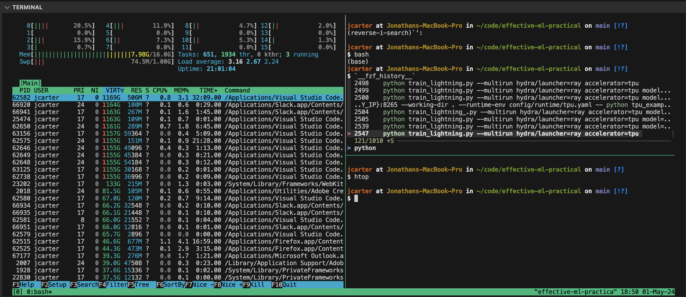

# Shell/Editor 101

This page contains quality-of-live improvements to your shell, software environment and editor for local and remote work e.g. on research group clusters.

Additional suggestions or better alternatives to the suggestions on this page are welcome!

# VSCode
VSCode is the most popular code editor, and probably its greatest strength is its large number of community extensions. I'd strongly recommend it over alternatives such as PyCharm.

## Remote VSCode


One of the most valuable extensions is the `Remote - SSH` Extension. This lets you directly develop code on a remote machine e.g. a cluster node, rather than developing locally and pushing/pulling changes via a remote terminal.

## Format-on-Save
VSCode can automatically format your files everytime you save them, using an auto-formatting tool such as Black or Ruff (a 100x faster equivalent written in Rust).
This takes away the manual work of avoiding your lines being too long, being consistent with the use of indentation etc.
See: https://code.visualstudio.com/docs/python/formatting for more info.

## Notebooks
VSCode natively supports Jupyter notebooks inc. over remote SSH:


# Shell
The suggestions below are intended for Unix shells e.g. Linux, MacOS.
</br><sub><sup>n.b. zsh is now the default shell on MacOS. However, whenever you connect to a remote machine, it will almost always use bash. Therefore, I use bash to avoid having to maintain configurations for both shells. Most of the snazzy functionality of zsh (and its community plugins) can be achieved with a well-configured set of dotfiles (see further below).</sup></sub>

## tmux


tmux is a terminal multiplexer. Probably it's main use-case is keeping (multiple) remote terminal sessions running in the background, which can be done from a single window.

Example (very simple) usage:
```
ssh user@remote
tmux # Start a new tmux session on the remote.
python my_long_running_script.py
```
then sometime later...
```
ssh user@remote
tmux at # Re-connect to the session
```
You can achieve much more exotic things with tmux, such as multiple panes/windows for different tasks:



## fzf (https://github.com/junegunn/fzf)
fzf can be used for a lot of command-line magic, but perhaps the most helpful feature of fzf is that it enables you to 'fuzzy'-search through your previous command history.


## zoxide (https://github.com/ajeetdsouza/zoxide)
This allows you to jump to commonly used directories:


## htop
GUI for inspecting running processes on a machine e.g. CPU utilisation, RAM usage.


(n.b. [zenith ](https://github.com/bvaisvil/zenith) written in Rust looks like a good alternative to htop.)

## dotfiles
The shell extensions described on this page are configured using `dotfiles` stored in your home directory: `.bashrc`, `.bash_profile` etc.

For more information about the responsibility of these various files, see e.g. https://driesvints.com/blog/getting-started-with-dotfiles/

Rather than store configuration for every machine you use, it makes sense to keep a personal `dotfiles` repo under version control that contains your configuration and commonly used install scripts. This can speed up the process of e.g. setting up your research environment on new machines, as your workflow to set-up a new machine reduces to:
1. `git pull` your `dotfiles` repository.
2. Run your install script.

Your install script will usually do things like install your desired shell extensions (e.g. `fzf`) and symlink the stored files to the correct path on the local machine e.g. `dotfiles/bashrc` -> `~/.bashrc`

dotfiles can also be used to store commonly used aliases, bash functions and scripts you regularly use: `alias gl=git pull`, `install_conda.sh` etc.


### Examples
A popular example dotfiles repo:</br>
https://github.com/mathiasbynens/dotfiles

My personal dotfiles:</br>
https://github.com/joncarter1/dotfiles