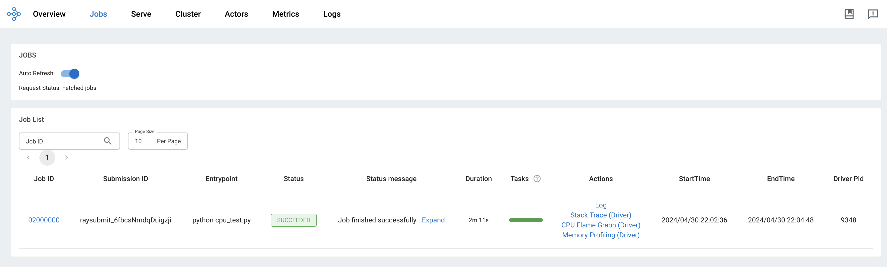
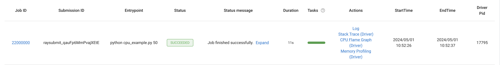

# Part 3: Ray

## Overview
In this part of the practical, we will run experiments on a remote cloud cluster managed using Ray[^1]. Ray is a framework for fault-tolerant, distributed computing in Python, being used by leading AI companies including Meta and OpenAI. It is believed to have been used to train ChatGPT[^2].

Ray can be used to parallelise Python code across a range of compute scales, from simple CPU parallelisation over the cores of your local machine right up to cloud clusters with thousands of compute nodes.

Here, we will make use of an auto-scaling Ray cluster, which automatically spins up and tears down heterogeneous (CPU/GPU/TPU) compute nodes depending on the number of running/queued jobs. This can help to reduce cloud expenditure, although all compute used in this practical was kindly provided for free by Google via their [TPU research cloud](https://sites.research.google/trc/about/).

## Set-up
1. [Connect to the University VPN](https://help.it.ox.ac.uk/vpn) and check that you can access the Ray cluster address in your browser (ask Jonathan for the IP address).

I've restricted access to the cluster to the IP address range of the University VPN as a simple security measure, rather than exposing it to the public internet.

2. Check that you can access the Ray cluster GUI by going to `http://ip:8265` where `ip` is the IP address of the Ray cluster. This should look something like:



3. Install and activate the local CPU-based environment with:
```bash
conda env create --file envs/environment_cpu.yaml
conda activate aims-ray
```

4. Set the Ray cluster IP address as an environment variable for use throughout the remainder of the practical:
```bash
export RAY_IP=xxx # e.g. 0.0.0.0
```
<sub><sup> For local testing, you can also run `ray start --head` locally and set `RAY_IP=localhost`. n.b. we're not setting the `RAY_ADDRESS` variable (detected by Ray) to let us easily switch between local and remote execution.</sup></sub>

## 1. Simple parallelisation
Ray can be used to perform simple parallelisation over the CPU cores of your local machine in Python. This can be simpler ([and faster](https://www.google.com/url?sa=t&source=web&rct=j&opi=89978449&url=https://yiblet.com/posts/how-is-ray-so-fast&ved=2ahUKEwjB2MeW7uqFAxXaQUEAHUwzBcUQFnoECA4QAw&usg=AOvVaw1aUNSYgwQHab7XfNL2TvD8)) than using e.g. `multiprocessing` or `joblib`, and useful for CPU-bound tasks such as pre-processing large datasets.

Run `python scripts/cpu_example.py 8` for a simple example of parallelisation in Ray. This runs 8 parallel tasks over the cores of your machine.

## 2. Parallelisation in the cloud
### CPU Parallelisation
Next, run the same script on the Ray cluster by running:
```bash
ray job submit --address http://${RAY_IP}:8265 --working-dir . -- python cpu_example.py 50
```
from the `scripts` directory. This will run 50 parallel tasks on the Ray cluster, each using a single CPU core. The `--working-dir` argument automatically uploads the files in your current directory to be able to execute the script remotely.

If you return to the Ray Dashboard (`http://ip:8265`) you should see your job running:

Depending on the number of other jobs running on the cluster, and the number of existing nodes, the cluster may scale up the number of compute nodes to handle this request.

<details>
<summary>Using custom runtime environments</summary>
Each cluster node has a base Conda environment with the correct dependencies installed to run the simple example above. However, you can also pass a YAML file which specifies a custom runtime environmen. For example:

```bash
ray job submit --address http://${RAY_IP}:8265 --working-dir . --runtime-env config/runtime/cpu.yaml -- python cpu_example.py 50
```
will run the script using the pre-installed `aims-ray` Conda environment on the cluster, rather than the `base` environment.
</br><sub><sup>If you're interested, you can find more info about Ray runtime environments [here](https://docs.ray.io/en/latest/ray-core/handling-dependencies.html#specifying-a-runtime-environment-per-job).</sup></sub>
</details>
</br>
<details>
<summary>Inspecting available resources</summary>
You can inspect the total resources available on the cluster by running:

```bash
ray job submit --address http://${RAY_IP}:8265 --working-dir . -- python inspect_cluster.py
```
</details>

### TPU Parallelisation
Next, run:
```bash
ray job submit --address http://${RAY_IP}:8265 --working-dir . --runtime-env config/runtime/tpu.yaml -- python tpu_example.py 10
```
This script will execute the `run_tpu` function 10 times on a TPU node, in parallel if resources allow, returning the result back to the head node. Here `run_tpu` is a simple matrix operation, but it could as easily be a deep learning training job. Libraries such as [Ray Train](https://docs.ray.io/en/latest/train/train.html) build on these simple primitives to enable distributed training.

## 3. Deep learning on Ray
Next, we will run the PyTorch example from Part 2 of the practical on the Ray cluster. To do this, we will use a Hydra launcher plugin for Ray, which allows you to switch between local and remote execution **with a single CLI flag**.

### a. CPU-based training
```bash
python train_model.py --multirun hydra/launcher=ray
```
will train the simple model from earlier in the cloud on a CPU. This uses the same files you modified earlier, which are symlinked into the local `scripts` directory. Additional configuration folders `hydra/launcher` and `accelerator` have been added, which allow us to seamlessly switch between local and remote execution, and between the type of accelerator used.

This script will tail the logs from the cloud, but Ctrl+C won't stop the remote job. To stop a job run `ray job stop --address http://${RAY_IP}:8265 raysubmit_xxxxx` where `raysubmit_xxx` is the job ID, which should appear in the logs and can also be found in the dashboard.

### b. TPU-based training
```bash
python train_model.py --multirun hydra/launcher=ray accelerator=tpu
```
will run the script on a TPU device using a **single** chip (out of a possible four).

### c. Training with PyTorch Lightning
To make use of all four chips on a TPU node, we will use [PyTorch Lightning](https://lightning.ai/docs/pytorch/stable/), a wrapper around PyTorch which helps to abstract away lots of the boilerplate involved in ML research. Lightning takes care of tasks such as making sure that data and models are distributed to the correct accelerators, which becomes particularly fiddly in a distributed setting.

```
python train_lightning.py --multirun hydra/launcher=ray accelerator=tpu 
```
will train the model across the four TPU chips on a single node, with Lightning handling inter-device communication for you.

You can train a model with approx. 50m parameters with:
```
python train_lightning.py --multirun hydra/launcher=ray accelerator=tpu model=mlp model.hidden_dims='[4096,4096,4096,4096]' train.refresh_rate=1
```

### d. Parallel jobs
If capacity allows, the following command will run your multi-run jobs in parallel across TPU nodes:
```bash
python train_lightning.py --multirun hydra/launcher=ray accelerator=tpu model=mlp,cnn optimizer.lr=1e-5,1e-4,1e-3
```

## 4. Go Ham.
Each machine in the cluster has one of the Conda environments specified in `envs` installed. The environment installed depends on the local accelerator: CPU or TPU. The environment includes `pytorch` and other common numerical libraries.

If you wish to use additional dependencies, you can create your own runtime environment similar to those in the `scripts/config/runtime` folder. The Ray cluster will then automatically install the Conda environment on the compute nodes.

Feel free to play around with CPU/TPU-based training. Each machine has around 150GB of disk if you wish to download datasets etc. I will leave the cluster running indefinitely i.e. until my free GCP Credits run out, which may not be very long. Enjoy!


## Misc.
### Slurm launcher
Slurm is widely used to manage research clusters within the University. There is also a Hydra launcher plugin for Slurm that achieves a similar effect to the Ray launcher used in this practical: https://hydra.cc/docs/plugins/submitit_launcher/

### Cloud computing
If you're interested in how cloud clusters such as the one we've used in this practical are provisioned using Ray, I have documented the set-up process for this practical and put the associated configuration and install scripts in the `cloud` folder.

[^1]: https://docs.ray.io/en/latest/index.html
[^2]: https://www.datanami.com/2023/02/10/anyscale-bolsters-ray-the-super-scalable-framework-used-to-train-chatgpt/
